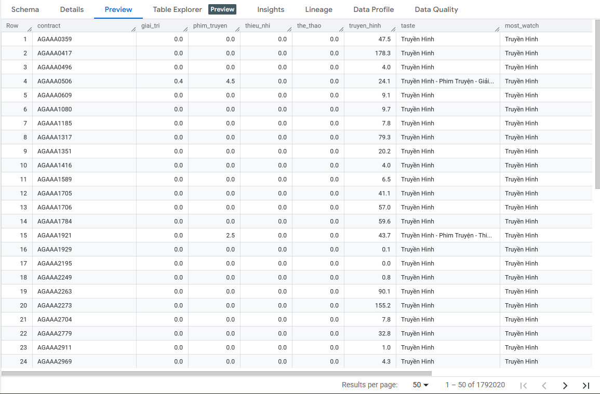
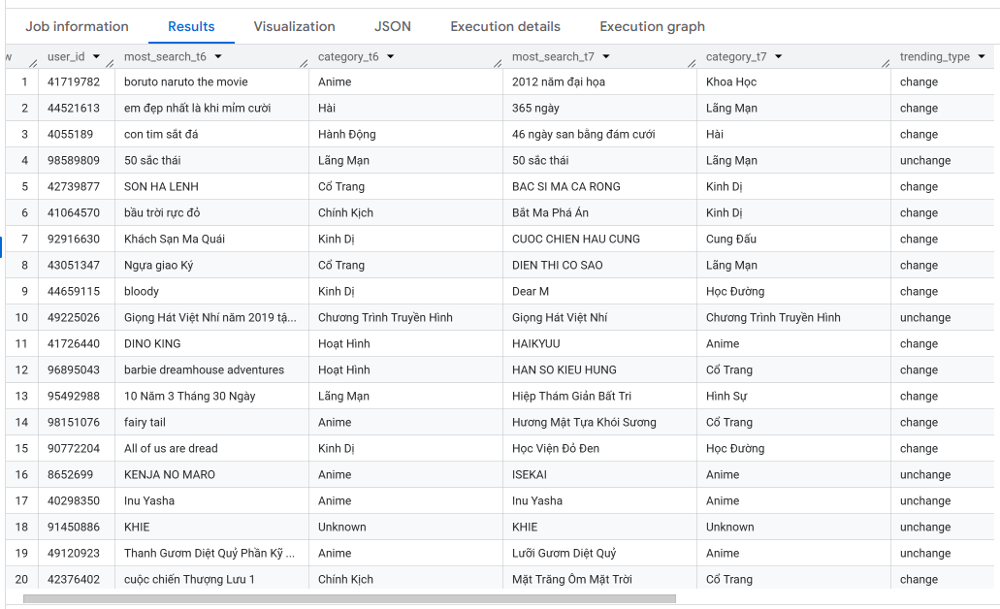

# Big Data ETL Pipeline for User Behavior and User Searching Behavior Analytics with PySpark

This project demonstrates an end-to-end ETL (Extract, Transform, Load) pipeline built with **Apache Spark (PySpark)** to process and analyze large-scale TV content viewing and searching content data. The final dataset is loaded into a **BigQuery** database and visualized using **Power BI**.

---

## 📌 Project Overview

- ✅ Built with **PySpark** to handle **large-scale JSON logs** and **large-scale Parquet logs** efficiently.
- 1. User behavior:
  + ✅ Categorized content based on `AppName` into user-friendly types (e.g., TV, Movies, Entertainment, Sports).
  + ✅ Calculated key **user behavior metrics**:
    - **Most watched Content Type**
    - **Taste Preferences**
    - **Watching Total hours  by channel**
- 2. User searching behavior:
  + ✅ Categorized searching keyword based on `Keyword` into detail category movies/shows (e.g., TV, Movies, Entertainment, Sports).
  + ✅ Calculated key **user searching behavior metrics**:
    - **Most watched Content Type**
    - **Taste Preferences**
    - **Watching Total hours  by channel**
- ✅ Stored results in **BigQuery** for downstream analytics or BI integration.
- ✅ Visualized results in an interactive **Power BI dashboard**.

---

## 🛠️ Tech Stack

| Component      | Description                                       |
|----------------|---------------------------------------------------|
| PySpark        | Distributed processing of JSON data               |
| Gemini API     | Categorize searching keyword                      |
| BigQuery       | Target data warehouse for storing aggregated data |
| Power BI       | Visualization of final behavioral metrics         |
| JSON & Parquet | Raw input data format                             |

---
## 🗂️ Project Structure
customer_360-etl_pipeline/
│

├── explore_log_content.py # Main ETL script for User Content Consumption Behavior

├── explore_log_search.py # Main ETL script for User Searching Behavior

├── data(sample data )/

│   ├── log_content/

│   │   ├── YYYYMMDD.json # Ví dụ tệp log nội dung

│   ├── log_search/

│   │   ├── YYYYMMDD.parquet # Ví dụ tệp log tìm kiếm

├── Power_BI

│   ├── Content_Consumption_and_Searching_Insights.pbix # Power BI dashboard file 

├── google_cloud_platform_account_service_keys.json

├── .env 

│
├── README.md # Project documentation

## 🔄 ETL Flow for User Content Consumption

1. **Extract**
   - Load JSON files daily from a folder.
   - Flatten nested fields and normalize the schema.

2. **Transform**
   - Categorize `AppName` into content types.
   - Pivot data by user `Contract` and `Content Type`.
   - Compute behavior metrics:
     - `Mostwatch`: Dominant content type watched
     - `Taste`: All genres the user interacts with
     

3. **Load**
   - Append final transformed data into BigQuery table: `viewing_time`.

📈 Sample Output
## 📈 Sample Output Schema

| Column         | Type       | Description                                 |
|----------------|------------|---------------------------------------------|
| contract       | string     | Unique user identifier                      |
| giai_tri       | bigint     | Total duration of Entertainment content     |
| phim_truyen    | bigint     | Total duration of Movie content             |
| the_thao       | bigint     | Total duration of Sports content            |
| thieu_nhi      | bigint     | Total duration of Children content          |
| truyen_hinh    | bigint     | Total duration of TV content                |
| most_watch     | string     | Most-watched content type                   |
| taste          | string     | Genres the user interacted with             |
## 💡 Sample Output

## 🔄 ETL Flow for User Searching Behavior

### 🔍 Step 1: Read Large-Scale Parquet Logs
- Load daily search logs (June & July)
- Combine and cache for performance

### 📊 Step 2: Identify Most Searched Keyword per User
- Group by `user_id` and `keyword`
- Use `row_number()` with Spark Window function to select the top search per user

### 🔁 Step 3: Compare Behavior Across Months
- Join June and July datasets by `user_id`
- Identify users whose **search category changed**

### 🧩 Step 4: Enrich Keyword Categories with Gemini API
- Call Gemini API to categorize keyword base on default specific categories
- Add dataframe `keyword_category`

### 🧩 Step 5: Enrich with Keyword Categories
- Join with `keyword_category` dataframe created above step 
- Add `category_t6`, `category_t7`, and `category_change`

### 💾 Step 6: Store Results in BigQuery
- Final schema: `trending`

## 🧾 Output Table Schema (MySQL)

| Column           | Type   | Description                                |
|------------------|--------|--------------------------------------------|
| user_id          | text   | Unique user identifier                     |
| most_search_t6   | text   | Most searched keyword in June              |
| category_t6      | text   | Corresponding category of the June keyword |
| most_search_t7   | text   | Most searched keyword in July              |
| category_t7      | text   | Corresponding category of the July keyword |
| category_change  | text   | 'unchanged' or "changed" if changed        |
## 💡 Sample Output

## 📊 Power BI Dashboard

# User content consumption

---
# User searching behavior

